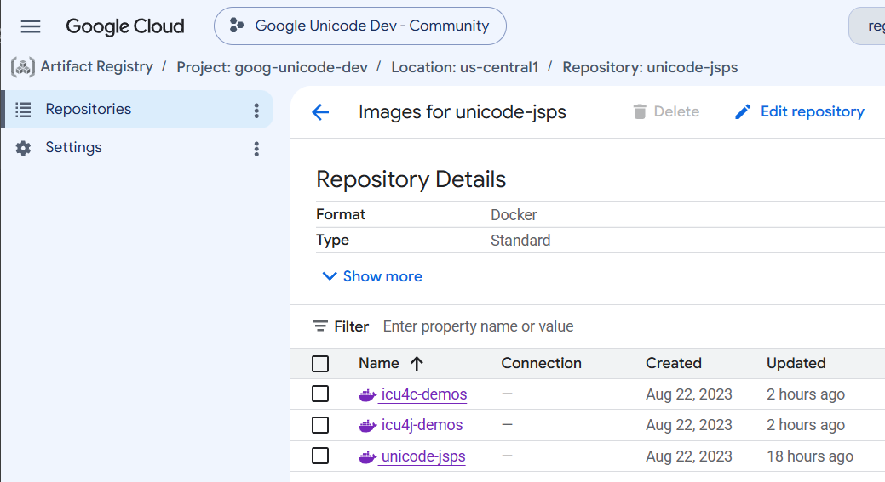
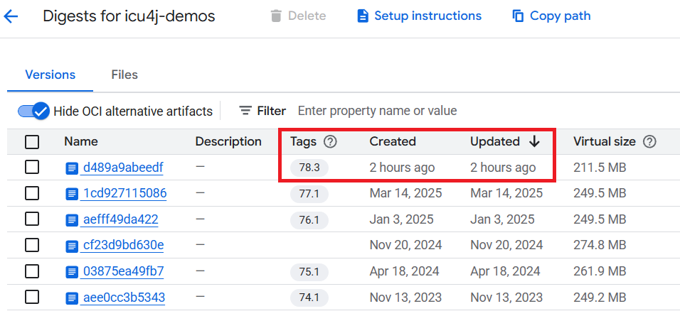
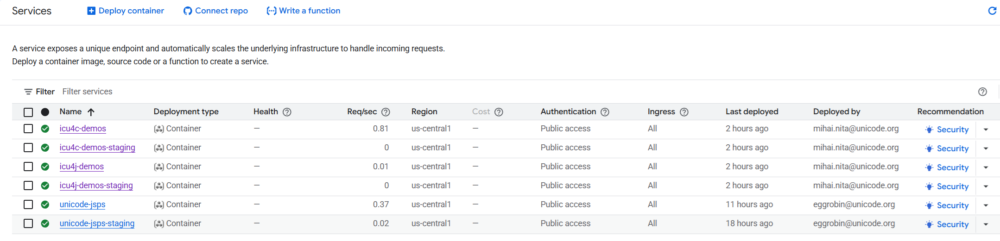
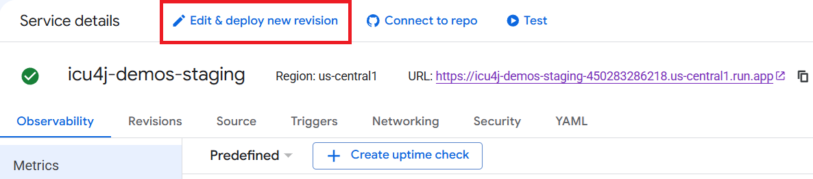
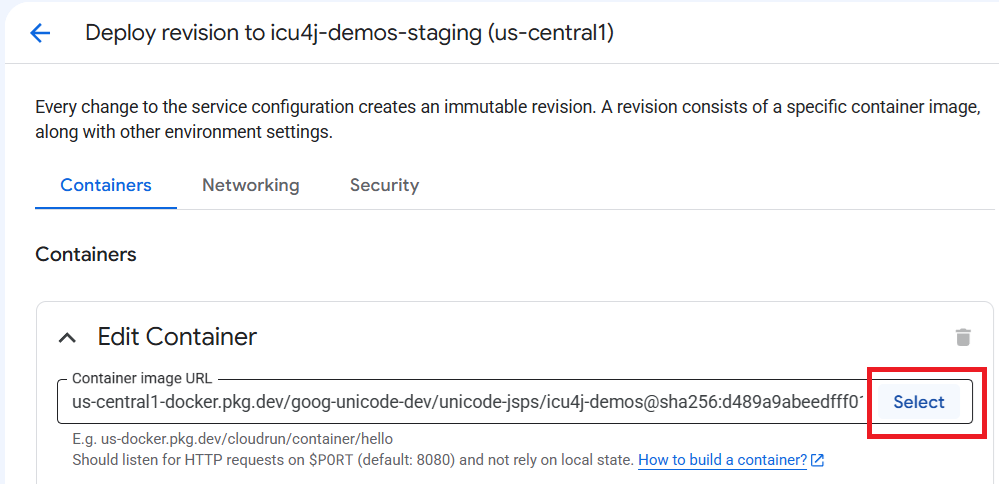
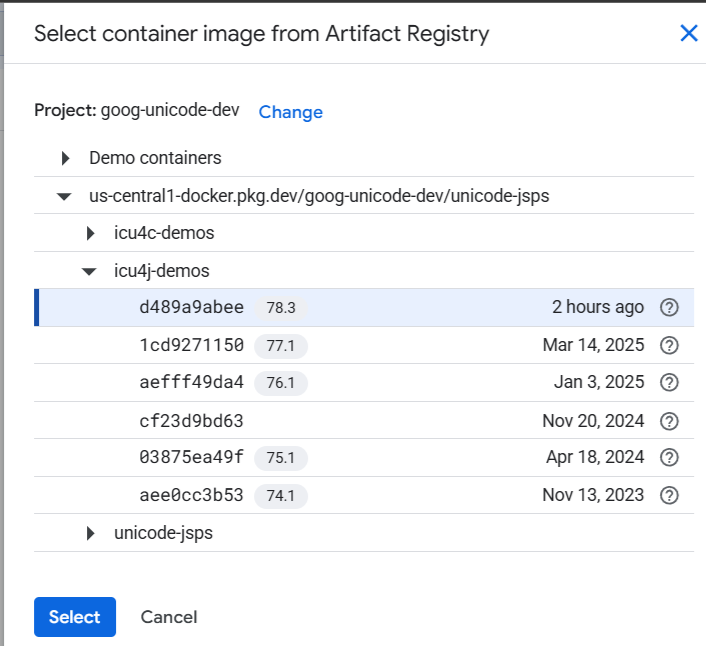
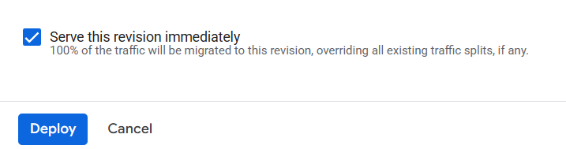
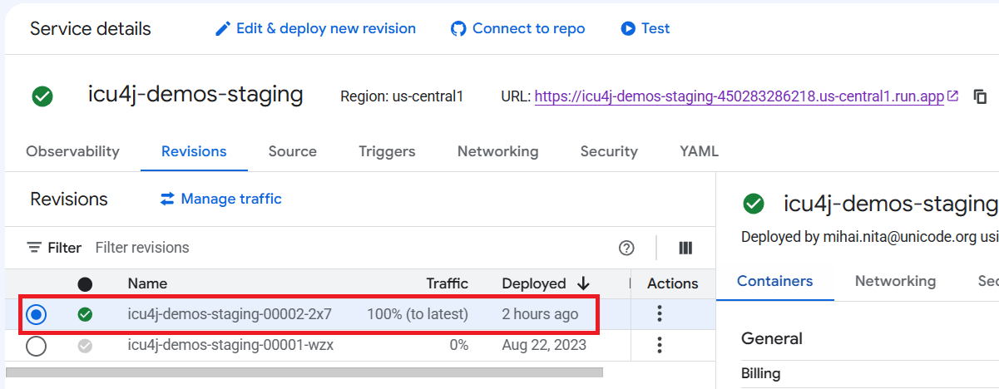
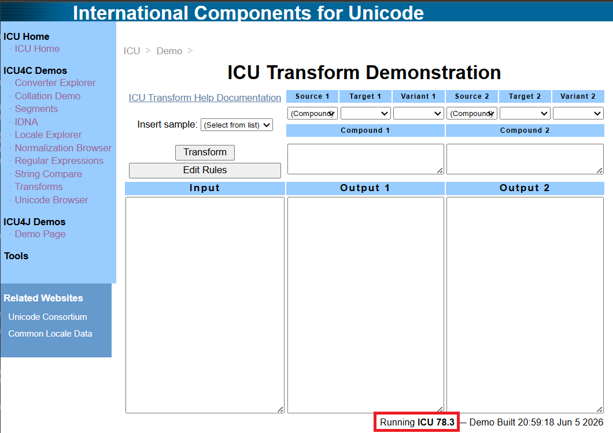
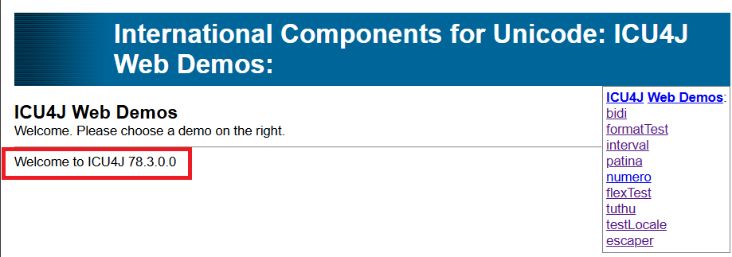

# ICU Java Web Demos

## BUILDING

### Update ICU4J version to get

* Edit `pom.xm` to choose the version already deployed to Maven Central.

    ```xml
    <icu4j.version>78.3</icu4j.version>
    ```

    or change it from from command line:

    ```sh
    mvn versions:set-property \
      -Dproperty=icu4j.version \
      -DnewVersion=78.3 \
      -DgenerateBackupPoms=false
    ```

    Before ICU 78 the versions was directly on the `<dependency>`:

    ```xml
    <artifactId>icu4j</artifactId>
    <version>71.1</version>
    ```

* Next, rebuild the demos with the latest ICU4J with this command:

    ```sh
    mvn package
    ```

## Running without [docker](https://docker.io)

```sh
# Run without rebuilding:
mvn cargo:run
# Or build, and run:
mvn package cargo:run
# Or even clean, build, and run:
mvn clean package cargo:run
```

The application will be available at http://localhost:8080/

**Note:** this is convenient for development, but we still recommend testing
with docker before deployment.

## Running with [docker](https://docker.io)

Note that this does not rebuild the demos, but just creates a new docker image for running locally.

* `sh build-docker.sh`
* `docker run --rm -p 8083:8080 unicode/icu4jweb:latest`  (^C to stop and delete the container)
* Verify that each demo program works [Run local docker image](http://127.0.0.1:8083/icu4jweb/).

## Deploy the public demos

See [ICU4C](https://icu4c-demos.unicode.org/icu-bin/) & [ICU4J](https://icu4j-demos.unicode.org/icu4jweb/).

To publish the demos, one needs access to the Google Cloud
[Google Unicode Dev - Community](https://console.cloud.google.com/run/overview?authuser=0&project=goog-unicode-dev) project.

### Build the Docker images and push to gcr

* First, make sure that the demos work locally in the previous step.
* Rebuild the docker image, tagging it appropriately.
* Edit `build-deploy.sh`, replacing `ICU_VER` with the release such as "78.3".
  * Suggestion: Update the script to get the release as a command line parameter.
* `sh build-deploy.sh`. Expect a final line such as:
  * "Successfully tagged ..."
* Next, authenticate with gcloud:
* `gcloud auth configure-docker`
* Edit `push-deploy.sh`, replacing `ICU_VER` with the same value as `build-deploy.sh`.
* Now push the tagged image to the GCloud:
* `sh push-deploy.sh`
* Verify that the push succeeds. Expect a message such as: \
  `"71.1: digest: sha256:d00e3bad53511402d4f9376b01cb9c3274f1cf6e75281aabb75e1c6e3f8766e0 size: 1999"`

### Managing Docker images in GCloud

If necessary open the [GCloud Artifact Registry](https://console.cloud.google.com/artifacts/docker/goog-unicode-dev/us-central1/unicode-jsps?authuser=0&project=goog-unicode-dev)
to rename, delete, and otherwise
manage the Docker images.



The "Updated" column for `icu4c-demos` and `icu4j-demos` should show some very
recent times, matching to the time when you executed `push-deploy.sh`.

If that is not the case then something went wrong with the deployment.

When you inspect the `icu4c-demos` and `icu4j-demos` packages you should
see docker images tagged with version you used in the `build-deploy.sh`
and `push-deploy.sh` scripts.



### Deploying from GCloud

Instructions updated June 2026.

* Open the [Cloud Run -- Services](https://console.cloud.google.com/run/services?authuser=0&project=goog-unicode-dev)

  

* Open one of the `icu4?-demos` or `icu4?-demos-staging` services

  You should first deploy the `icu4?-demos-staging`, check them,
  then deploy the `icu4j-demos`

  The screenshots show `icu4j-demos-staging`, but the 3 others are identical.

* Click "Edit & deploy new version"

  

* Click the "Select" button under "Containers" -- "Container image URL"

  

* Navigate to the new image to use

  

  Select the image (checking the times and the tag) and click the "Select" button.

* Scroll all the way down and click the "Deploy" button

  

  Notice that the "Serve this revision immediately" is checked.
  Keep it checked.

* Back in the service select the "Revisions" tab

  

  The revision you just deployed should have a green checkmark, show 100% traffic,
  and a very recent deployment time (when you clicked "Deploy" in the previous step).

* Check the deployment

  Click the URL at that top (`https://icu4j-demos-staging-450283286218.us-central1.run.app`
  in our screenshot).

  For `icu4j-demos` that will show you a 404 page.
  Append `/icu4jweb/` after it (`...us-central1.run.app/icu4jweb/`).
  You should be able to play with the Java demos.

  For `icu4c-demos` the URL will take you directly to the working C/C++ demos.

* If everything looks good in `icu4?-demos-staging` then repeat it for `icu4?-demos`

* Finally, if you went through the process with the `icu4?-demos` then you should
be able to check that the public demos use the correct ICU version.

  **ICU4C:** https://icu4c-demos.unicode.org/icu-bin/translit

  

  **ICU4J:** https://icu4j-demos.unicode.org/icu4jweb/

  

## License

Please see [Unicode LICENSE file.](../LICENSE)

> Copyright © 2016 and later Unicode, Inc. and others. All Rights Reserved.
Unicode and the Unicode Logo are registered trademarks 
of Unicode, Inc. in the U.S. and other countries.
[Terms of Use and License](http://www.unicode.org/copyright.html)
