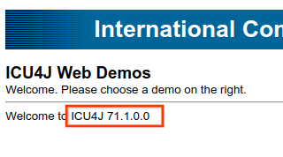

### ICU Java Web Demos

# BUILDING

## Update ICU4J version to get
* Edit pom.xml to choose the version already deployed to Maven Central.

```      <artifactId>icu4j</artifactId>
         <version>71.1</version>
```
* Next, rebuild the demos with the latest ICU4J with this command:
- `mvn package`


# RUNNING WITH [docker](https://docker.io)
Note that this does not rebuild the demos, but just creates a new docker image for running locally.

- `sh build-docker.sh`
- `docker run --rm -p 8083:8080 unicode/icu4jweb:latest`  (^C to stop and delete the container)
- Verify that each demo program works [Run latest docker image](http://127.0.0.1:8083/icu4jweb/).

# Deploy to [public demo](https://icu4j-demos.unicode.org/icu4jweb/)
To publish the demos, one needs access to the Google Cloud [ICU4C demos project](https://console.cloud.google.com/run?project=goog-unicode-dev).

- First, make sure that the demos work locally in the previous step.
- Rebuild the docker image, tagging it appropriately.
- Edit build-deploy.sh, replacing "latest" with the release such as "71.1".
  - Suggestion: Update the script to get the release as a command line parameter.
- `sh build-deploy.sh`. Expect a final line such as:
  - "Successfully tagged us-central1-docker.pkg.dev/goog-unicode-dev/unicode-jsps/icu4c-demos:icu4c_74_1"
- Next, authenticate with gcloud:
- `gcloud auth configure-docker us-central1-docker.pkg.dev`
- Edit push-deploy.sh, replacing "latest" with the tag used in build-deploy.sh.
- Now push the tagged image to the GCloud:
- `sh push-deploy.sh`
- Verify that the push succeeds. Expect a command such as
  - "71.1: digest: sha256:d00e3bad53511402d4f9376b01cb9c3274f1cf6e75281aabb75e1c6e3f8766e0 size: 1999"


## Managing Docker images in Gcloud
If necessary, use this link to rename, delete, and otherwise [mangage Docker images](https://console.cloud.google.com/gcr/images/icu4c-demos?project=icu4c-demos).

### Deploying from GCloud:
Instructions updated April 2022.
- Open [GCloud for icu4jweb](https://console.cloud.google.com/run/deploy/us-central1/icu4jweb?project=icu4c-demos)


- Touch the "Select button" under "Container image URL".


- Open the menu item "gcr.io/icu4c-demos/icu4jweb".
- Highlight and then select (big blue button) the latest image that was pushed.
- Select "Deploy" (big blue button, lower left).


- Finally, check that the [deployed Web Demo](https://icu4j-demos.unicode.org/icu4jweb/) shows the correct version. It should look like this:



# License

Please see [Unicode LICENSE file.](../LICENSE)

> Copyright © 2016 and later Unicode, Inc. and others. All Rights Reserved.
Unicode and the Unicode Logo are registered trademarks 
of Unicode, Inc. in the U.S. and other countries.
[Terms of Use and License](http://www.unicode.org/copyright.html)
